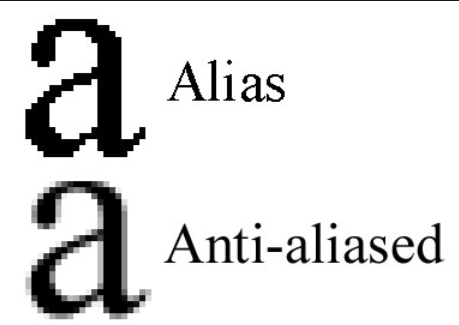

# Optimizing Fonts and Images

## How Next js optimize fonts?

- Next.js downloads font files at build time and hosts them with your other static assets.
- This means when a user visits your application, there are no additional network requests for fonts which would impact performance.

## How to add fonts

In app/ui add font.ts

```ts
import { Inter } from 'next/font/google';

export const inter = Inter({ subsets: ['latin'] });
```

Open layout.tsx

```tsx
import '@/app/ui/global.css';
import { inter } from '@/app/ui/fonts';

export default function RootLayout({
  children,
}: {
  children: React.ReactNode;
}) {
  return (
    <html lang="en">
      <body className={`${inter.className} antialiased`}>{children}</body>
    </html>
  );
}
```



## Problem with using images the traditional way

you have to manually:

Ensure your image is responsive on different screen sizes.

Specify image sizes for different devices.

Prevent layout shift as the images load.

Lazy load images that are outside the user's viewport.

<i><b>Instead of manually implementing these optimizations, you can use the <code>next/image</code> component to automatically optimize your images.</b></i>

## Image Optimization in NextJs

- Next.js can serve static assets, like images, under the top-level `/public` folder. Files inside /public can be referenced in your application.
### The `<Image/>` component - 
The `<Image>` Component is an extension of the HTML  tag, and comes with automatic image optimization, such as:

- Preventing layout shift automatically when images are loading.
- Resizing images to avoid shipping large images to devices with a smaller viewport.
- Lazy loading images by default (images load as they enter the viewport).
- Serving images in modern formats, like WebP and AVIF, when the browser supports it.

```tsx
import AcmeLogo from '@/app/ui/acme-logo';
import { ArrowRightIcon } from '@heroicons/react/24/outline';
import Link from 'next/link';
import { lusitana } from '@/app/ui/fonts';
import Image from 'next/image';
 
export default function Page() {
  return (
    // ...
    <div className="flex items-center justify-center p-6 md:w-3/5 md:px-28 md:py-12">
      {/* Add Hero Images Here */}
      <Image
        src="/hero-desktop.png"
        width={1000}
        height={760}
        className="hidden md:block"
        alt="Screenshots of the dashboard project showing desktop version"
      />
    </div>
    //...
  );
}
```

Images without dimensions and web fonts are common causes of layout shift due to the browser having to download additional resources.