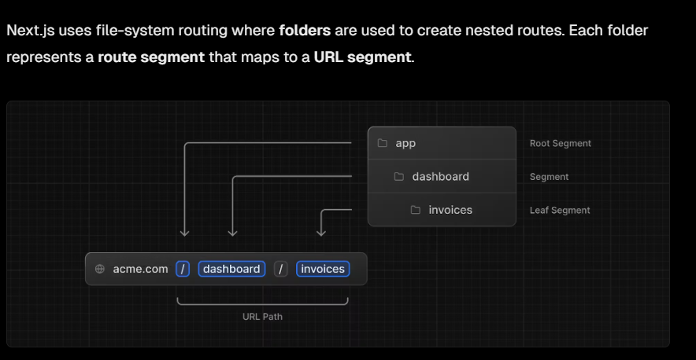
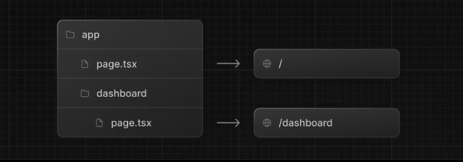
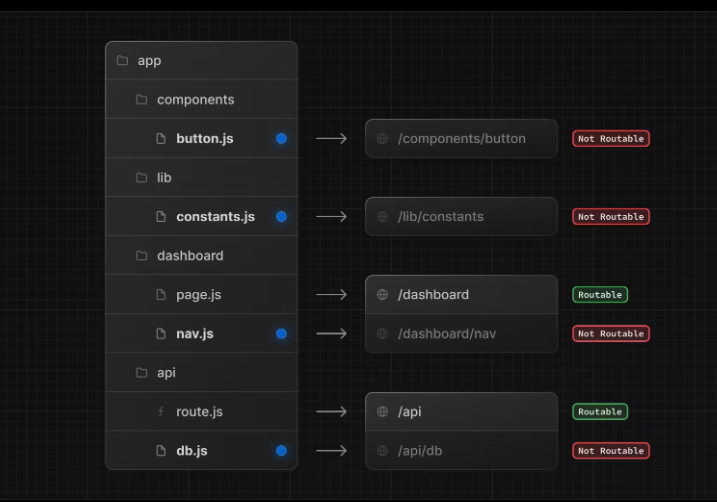
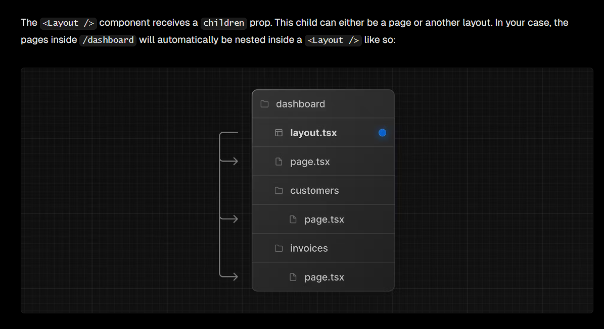
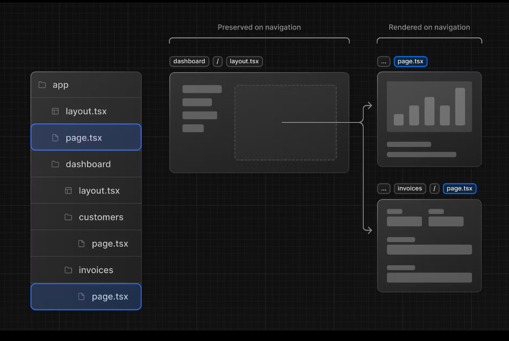
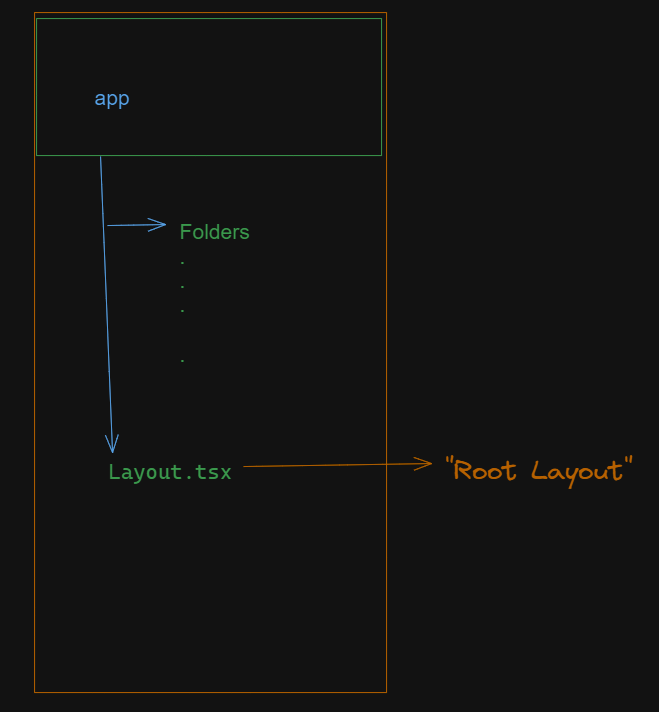

# Creating Layouts and Pages

## Nested routing



- You can create separate UIs for each route using layout.tsx and page.tsx files.

- page.tsx is a special Next.js file that exports a React component, and it's required for the route to be accessible.



## Colocation in nextjs 14

- Colocation refers to placing two or more things in the same location.
- Colocation specifically refers to the practice of storing data files like API routes, static files, and components in the same directory as the JavaScript code that uses them
  
  Benefits of colocation in Next.js:
- Faster data access: Data files are closer to the code, reducing file system lookup overhead.
- Improved developer experience: Project structure is more logical and intuitive.
- Simplified configuration: Next.js might automatically discover and use correctly located files.
  

## layouts in nextjs

- In Next.js, you can use a special `layout.tsx`file to create UI that is shared between multiple pages.
- the layout file is the best way to create a shared layout that all pages in your application can use.
  In `/app/dashboard/layout.tsx`-

```tsx
import SideNav from '@/app/ui/dashboard/sidenav';
export default function Layout({ children }: { children: React.ReactNode }) {
  return (
    <div className="flex h-screen flex-col md:flex-row md:overflow-hidden">
      <div className="w-full flex-none md:w-64">
        <SideNav />
      </div>
      <div className="flex-grow p-6 md:overflow-y-auto md:p-12">{children}</div>
    </div>
  );
}
```



## Partial Rendering in next js

- One benefit of using layouts in Next.js is that on navigation, only the page components update while the layout won't re-render.
- allows you to add dynamic elements like user data, personalized recommendations, and interactive features.
- gives you a fast initial load and a dynamic experience without a full page reload.
  

## Root Layout

- The root layout is defined at the top level of the app directory and applies to all routes. This layout enables you to modify the initial HTML returned from the server.
- The app directory must include a root layout.
- The root layout must define <html> and <body> tags since Next.js does not automatically create them
- Any UI you add to the root layout will be shared across all pages in your application. You can use the root layout to modify your <html> and <body> tags, and add metadata
  
