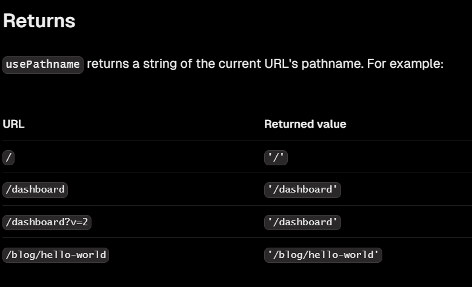

# Navigating Between Pages

## why optimize navigation? `<Link/>`

- anchor tag fully refreshes the page
- you can use the `<Link />` Component to link between pages in your application. `<Link>` allows you to do client-side navigation with JavaScript.
- using it you navigate between pages without having a full page refresh

### Automatic code-splitting and prefetching

- Although parts of your application are rendered on the server, there's no full page refresh, making it feel like a web app. Why is that?
- To improve the navigation experience, Next.js automatically code splits your application by route segments
- Splitting code by routes means that pages become isolated. If a certain page throws an error, the rest of the application will still work.
- Next.js automatically prefetches the code for the linked route in the background. By the time the user clicks the link, the code for the destination page will already be loaded in the background, and this is what makes the page transition near-instant!

## Showing active links

### `usePathname` -

- lets you read the current URL's pathname.
- intentionally requires using a Client Component.
- Reading the current URL from a Server Component is not supported. This design is intentional to support layout state being preserved across page navigations.
  

```tsx
'use client';

import {
  UserGroupIcon,
  HomeIcon,
  DocumentDuplicateIcon,
} from '@heroicons/react/24/outline';
import Link from 'next/link';
import { usePathname } from 'next/navigation';
import clsx from 'clsx';
export default function NavLinks() {
  const pathname = usePathname();
  return (
    <>
      {links.map((link) => {
        const LinkIcon = link.icon;
        return (
          <Link
            key={link.name}
            href={link.href}
            className={clsx(
              'flex h-[48px] grow items-center justify-center gap-2 rounded-md bg-gray-50 p-3 text-sm font-medium hover:bg-sky-100 hover:text-blue-600 md:flex-none md:justify-start md:p-2 md:px-3',
              {
                'bg-sky-100 text-blue-600': pathname === link.href,
              },
            )}
          >
            <LinkIcon className="w-6" />
            <p className="hidden md:block">{link.name}</p>
          </Link>
        );
      })}
    </>
  );
}
```
