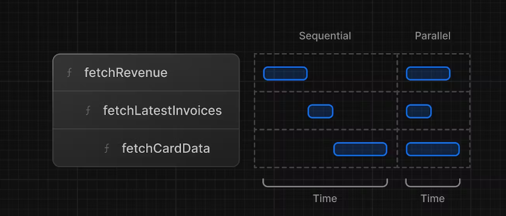

# Fetching Data

## api and database queries

- APIs are an intermediary layer between your application code and database.
- In Next.js, you can create API endpoints using Route Handlers.
- If you are using React Server Components (fetching data on the server), you can skip the API layer, and query your database directly without risking exposing your database secrets to the client.

## using server components to fetch data

- By default, Next.js applications use React Server Components.
- Server Components support promises, providing a simpler solution for asynchronous tasks like data fetching. You can use async/await syntax **_without_** reaching out for useEffect, useState or data fetching libraries.
- Server Components execute on the server, so you can keep expensive data fetches and logic on the server and only send the result to the client, without an additional API layer.

## using `sql`

- SQL allows you to write targeted queries to fetch and manipulate specific data.
  In app/lib/data.ts -

```ts
import { sql } from '@vercel/postgres';
export async function fetchDBOperation() {
  try {
    // Fetch the last 5 invoices, sorted by date
    const data = await sql<LatestInvoiceRaw>`
      SELECT invoices.amount, customers.name, customers.image_url, customers.email, invoices.id
      FROM invoices
      JOIN customers ON invoices.customer_id = customers.id
      ORDER BY invoices.date DESC
      LIMIT 5`;

    const latestInvoices = data.rows.map((invoice) => ({
      ...invoice,
      amount: formatCurrency(invoice.amount),
    }));
    return latestInvoices;
  } catch (error) {
    console.error('Database Error:', error);
    throw new Error('Failed to fetch the latest invoices.');
  }
}
```

- **Good Practice-** You can call `sql` inside any Server Component. But to allow you to navigate the components more easily, we've kept all the data queries in the data.ts file, and you can import them into the components.
- get data from those operations in any component like this -

```tsx
import { fetchRevenue } from '@/app/lib/data';
export default async function Page() {
  const revenue = await fetchRevenue();
  // ...
}
```

## Request waterfalls

- A "waterfall" refers to a sequence of network requests that depend on the completion of previous requests.
- In the case of data fetching, each request can only begin once the previous request has returned data.
- not necessarily bad, there may be cases where you actually may need it
- For example, you might want to fetch a user's ID and profile information first. Once you have the ID, you might then proceed to fetch their list of friends.
- However, this behavior can also be unintentional and impact performance.

## Parallel Data fetching using _JS pattern_

- A common way to avoid waterfalls is to initiate all data requests at the same time - in parallel.
- In JavaScript, you can use the `Promise.all()` or `Promise.allSettled()` functions to initiate all promises at the same time.
- For example, in data.ts, we're using` Promise.all()` in the fetchCardData() function:

```tsx
export async function fetchCardData() {
  try {
    const invoiceCountPromise = sql`SELECT COUNT(*) FROM invoices`;
    const customerCountPromise = sql`SELECT COUNT(*) FROM customers`;
    const invoiceStatusPromise = sql`SELECT
         SUM(CASE WHEN status = 'paid' THEN amount ELSE 0 END) AS "paid",
         SUM(CASE WHEN status = 'pending' THEN amount ELSE 0 END) AS "pending"
         FROM invoices`;

    const data = await Promise.all([
      invoiceCountPromise,
      customerCountPromise,
      invoiceStatusPromise,
    ]);
    // ...
  }
}
```
- Pro's -
    - Start executing all data fetches at the same time, which can lead to performance gains.
    - Use a native JavaScript pattern that can be applied to any library or framework.


- Con's - what happens if one data request is slower than all the others?


