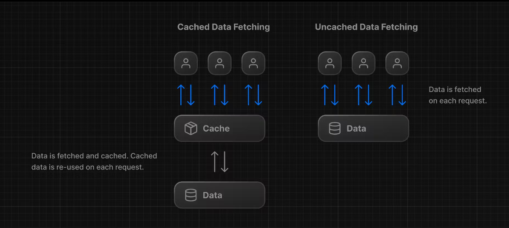

# Static and Dynamic Rendering

## what is static rendering?

**Data fetching:** This refers to the process of retrieving information from a source, like a database or an API. In this context, it means getting the necessary data to populate your website's content.

**Rendering:** This is the process of taking the data and using it to generate the HTML code that forms the actual webpage that users see. It involves combining the data with a template or layout.

**Cache:** This is a temporary storage space where frequently accessed data is kept for faster retrieval. When a user requests a webpage, the server can check the cache first. If the page is already there, it can be served immediately instead of re-fetching the data and rendering it again.

**CDN (Content Delivery Network):** This is a geographically distributed network of servers that store cached content closer to users. When a user requests a webpage, the CDN tries to serve it from the server closest to the user, improving website loading speed and performance.

- **Static rendering** means the HTML code for your website is pre-generated on the server, either at deployment time or during revalidation (where the data and rendering are refreshed periodically).
- Since the HTML is already created, there's no need to fetch data and render it on the user's device.
- This pre-generated HTML can then be distributed and cached on servers across the globe in a **CDN**.
- When a user requests a page, the CDN checks its local cache. If the page is there, it can be served immediately without needing to contact the origin server, resulting in faster loading times.

**Key points:**

- Static rendering is ideal for content that doesn't change frequently, like blog posts or landing pages.
- It offers better performance and scalability compared to server-side rendering, reduces server load and makes website faster.
- However, it's not suitable for highly dynamic content that changes often, like e-commerce product pages or personalized dashboards.
- When your data updates, you want to show the latest changes in your dashboard. Static Rendering is not a good fit for this use case.
  

## what is dynamic rendering?

- With dynamic rendering, content is rendered on the server for each user at request time (when the user visits the page).
- Dynamic rendering allows your application to display **_real-time or frequently_** updated data. This is ideal for applications where data changes often.
- It's easier to serve **_personalized_** content, such as dashboards or user profiles, and update the data based on user interaction.
- Dynamic rendering allows you to access information that can only be known at request time, such as cookies or the URL search parameters.

## making dashboard dynamic

- You can use a Next.js API called `unstable_noStore` inside your Server Components or data fetching functions to opt out of static rendering.
- Note: `unstable_noStore` is an experimental API and may change in the future. If you prefer to use a stable API in your own projects, you can also use the Segment Config Option export const dynamic = "force-dynamic".
  In `app/lib/data.ts` -

```ts
// ...
import { unstable_noStore as noStore } from 'next/cache';

export async function fetchRevenue() {
  // Add noStore() here to prevent the response from being cached.
  // This is equivalent to in fetch(..., {cache: 'no-store'}).
  noStore();

  // ...
}

export async function fetchLatestInvoices() {
  noStore();
  // ...
}

export async function fetchCardData() {
  noStore();
  // ...
}

export async function fetchFilteredInvoices(
  query: string,
  currentPage: number,
) {
  noStore();
  // ...
}

export async function fetchInvoicesPages(query: string) {
  noStore();
  // ...
}

export async function fetchFilteredCustomers(query: string) {
  noStore();
  // ...
}

export async function fetchInvoiceById(query: string) {
  noStore();
  // ...
}
```

### What happens if one data request is slower than all the others?

#### With dynamic rendering, your application is only as fast as your slowest data fetch.