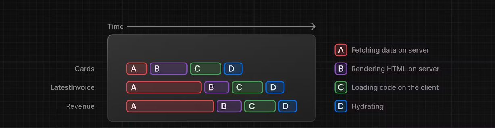
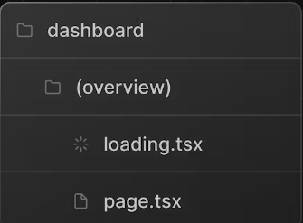

# Streaming

Streaming is a data transfer technique that allows you to break down a route into smaller "chunks" and progressively stream them from the server to the client as they become ready.

By streaming, you can prevent slow data requests from blocking your whole page. This allows the user to see and interact with parts of the page without waiting for all the data to load before any UI can be shown to the user.



Chunks are rendered in parallel, reducing the overall load time.

One advantage of this approach is that you can significantly reduce your page's overall loading time.

Two ways to implement it -

1. At the page level, with the `loading.tsx` file.
2. For specific components, with `<Suspense>`.

## streaming whole page with `loading.tsx`

In the /app/dashboard folder, create a new file called loading.tsx:

```tsx
export default function Loading() {
  return <div>Loading...</div>;
}
```

1. loading.tsx is a special Next.js file built on top of Suspense, it allows you to create fallback UI to show as a replacement while page content loads.
2. Since <SideNav> is static, it's shown immediately. The user can interact with <SideNav> while the dynamic content is loading.
3. The user doesn't have to wait for the page to finish loading before navigating away (this is called interruptable navigation).

A loading skeleton is a simplified version of the UI. Many websites use them as a placeholder (or fallback) to indicate to users that the content is loading. Any UI you embed into loading.tsx will be embedded as part of the static file, and sent first. Then, the rest of the dynamic content will be streamed from the server to the client.

```tsx
import DashboardSkeleton from '@/app/ui/skeletons';
export default function Loading() {
  return <DashboardSkeleton />;
}
```

## Fixing loading skeleton bug

Right now, your loading skeleton will apply to the invoices and customers pages as well.


Route groups allow you to organize files into logical groups without affecting the URL path structure. When you create a new folder using parentheses (), the name won't be included in the URL path. So `/dashboard/(overview)/page.tsx` becomes `/dashboard`.

Here, you're using a route group to ensure loading.tsx only applies to your dashboard overview page. However, you can also use route groups to separate your application into sections (e.g. (marketing) routes and (shop) routes) or by teams for larger applications

## Streaming a component

- So far, you're streaming a whole page. But, instead, you can be more granular and stream specific components using React Suspense.
- Suspense allows you to defer rendering parts of your application until some condition is met (e.g. data is loaded). You can wrap your dynamic components in Suspense. Then, pass it a fallback component to show while the dynamic component loads.
- fetchRevenue(), this is the request that is slowing down the whole page. Instead of blocking your page, you can use Suspense to stream only this component and immediately show the rest of the page's UI.

1. Delete all instances of fetchRevenue() and its data from /dashboard/(overview)/page.tsx
2. Then, import `<Suspense>`from React, and wrap it around <RevenueChart />. You can pass it a fallback component called `<RevenueChartSkeleton>`.
   In page.tsx -

```tsx
import { Suspense } from 'react';
import { RevenueChartSkeleton } from '@/app/ui/skeletons';
export default async function Page() {
  return (
    <main>
      <div className="mt-6 grid grid-cols-1 gap-6 md:grid-cols-4 lg:grid-cols-8">
        <Suspense fallback={<RevenueChartSkeleton />}>
          <RevenueChart />
        </Suspense>
        <LatestInvoices latestInvoices={latestInvoices} />
      </div>
      ;
    </main>
  );
}
```

3. Finally, update the <RevenueChart> component to fetch its own data and remove the prop passed to it:

```tsx
import { fetchRevenue } from '@/app/lib/data';
export default async function RevenueChart() { // Make component async, remove the props
  const revenue = await fetchRevenue(); // Fetch data inside the component
```

## grouping components

You can fetch data for each individual card, but this could lead to a popping effect as the cards load in, this can be visually jarring for the user.

To create more of a staggered effect, you can group the cards using a wrapper component. This means the static <SideNav/> will be shown first, followed by the cards, etc.

In your page.tsx file:

1. Delete your <Card> components.
2. Delete the fetchCardData() function.
3. Import a new wrapper component called <CardWrapper />.
4. Import a new skeleton component called <CardsSkeleton />.
5. Wrap <CardWrapper /> in Suspense.

By moving data fetching down to the components that need it, you can create more granular Suspense boundaries. This allows you to stream specific components and prevent the UI from blocking