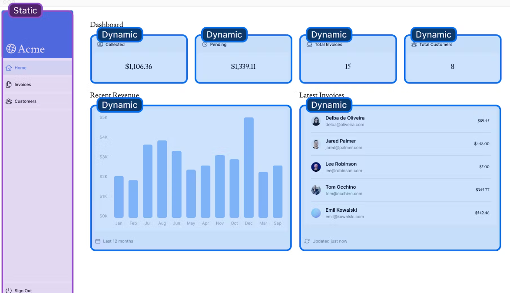
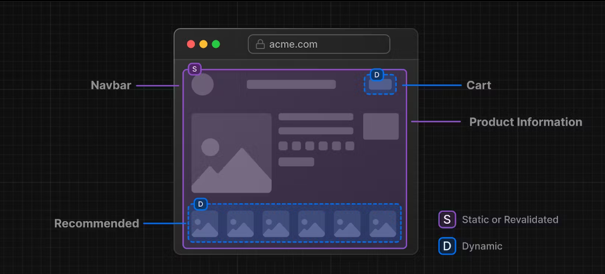
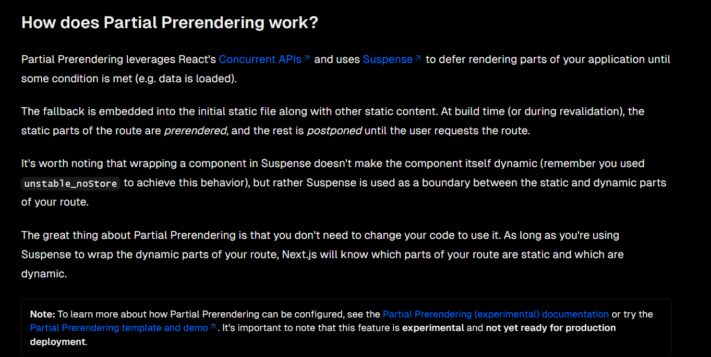

# Partial Prerendering

Partial Prerendering is an experimental feature introduced in Next.js 14. The content of this page may be updated as the feature progresses in stability. You may want to skip this chapter if you prefer to not use experimental features.

Currently, if you call a dynamic function inside your route (e.g. noStore(), cookies(), etc), your entire route becomes dynamic.

This is how most web apps are built today. You either choose between static and dynamic rendering for your entire application or for a specific route.

However, most routes are not fully static or dynamic. You may have a route that has both static and dynamic content

## what is partial pre-rendering

Next.js 14 contains a preview of Partial Prerendering – an experimental feature that allows you to render a route with a static loading shell, while keeping some parts dynamic. In other words, you can isolate the dynamic parts of a route. For example:

When a user visits a route:

- A static route shell is served, ensuring a fast initial load.
- The shell leaves holes where dynamic content will load in asynchronous.
- The async holes are streamed in parallel, reducing the overall load time of the page.
- This is different from how your application behaves today, where entire routes are either entirely static or dynamic.

**Note** - _Holes are locations where dynamic content will load asynchronously at request time._

Partial Prerendering combines ultra-quick static edge delivery with fully dynamic capabilities and we believe it has the potential to become the default rendering model for web applications, bringing together the best of static site generation and dynamic delivery.

## how does it work ?
